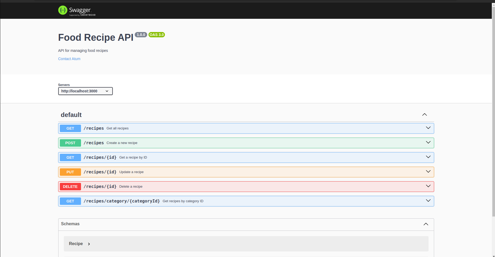

# Food Recipe API

This repository hosts a backend API for a food recipe application. The API provides endpoints to manage recipes and ingredients, leveraging a PostgreSQL database for data storage.

## Requirements

- Node.js (v18 or later)
- PostgreSQL database

## Installation

1. **Clone the repository:**
   ```javascript
   //Open your terminal on your machine and run the commands below
   git clone https://github.com/Richkum/Food_recipe_API
   cd Food_recipe_API
   ```
2. **Install the dependencies:**
   ```javascript
   //Open a terminal in your editor and run the command below
   npm install
   ```
3. **Set up the PostgreSQL database:**
   . Create a new PostgreSQL database:

   - Open your PostgreSQL client
   - Create a new database with a command like `CREATE DATABASE your_database_name`;.
     .Update the database connection credentials:

   - Locate the `.env` file in the root of your project.
   - Open `.env` and update the environment variables with your PostgreSQL database details:

   ```javascript
   DB_HOST = your_database_host;
   DB_PORT = your_database_port;
   DB_NAME = your_database_name;
   DB_USER = your_database_username;
   DB_PASSWORD = your_database_password;
   ```

   .Save your changes to the `.env` file.
   Ensure this file is not committed to your version control system.

4. **Configure the database connection:**

- In your main application file (e.g.,` app.js`), import the required modules and establish the database connection using the environment variables from the .env file.
- Ensure your application successfully connects to the PostgreSQL database.

5. **Start the server:**

```javascript
//Open a terminal in your editor and run the command below
npm run dev
```

[The API server will start running on] (http://localhost:3000).

## API Documentation

Access the API documentation at the `/api-docs` endpoint. It provides detailed information about the endpoints, including request and response structures and usage examples.

## Endpoints



## Contributing

Contributions are welcome! If you encounter any issues or have suggestions for improvements, please open an issue or submit a pull request.

## License

This project is licensed under the MIT License.
